# Olá, eu sou o Matheus Soares 👋

### 👨‍💻 Sobre mim
- 🎓 Estudante de **Informática** no **Instituto Federal de Alagoas (IFAL)**.
- 🎯 Atualmente focado em desenvolvimento **Backend**.
- 🚀 Constantemente aprendendo novas tecnologias e explorando o ecossistema de desenvolvimento.

---

### 🛠️ Tecnologias e Ferramentas

**Linguagens de Programação**

**Frameworks e Bibliotecas**

**Banco de Dados e Ferramentas**

---

### 📊 Estatísticas do GitHub

  <table style="border: none; border-collapse: collapse;">
    <tr>
      <td valign="center" style="border: none;">
        
      </td>
      <td valign="center" style="border: none;">
        
      </td>
    </tr>
  </table>

---

### 🤝 Vamos nos conectar?

