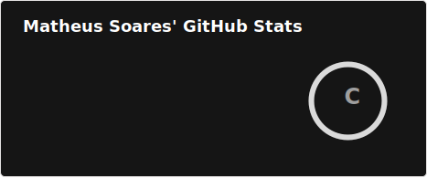
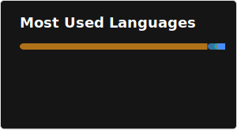

# Olá, eu sou o Matheus Soares 👋

### 👨‍💻 Sobre mim
- 🎓 Estudante de **Informática** no **Instituto Federal de Alagoas (IFAL)**.
- 🎯 Atualmente focado em desenvolvimento **Backend**.
- 🚀 Constantemente aprendendo novas tecnologias e explorando o ecossistema de desenvolvimento.

---

### 🛠️ Tecnologias e Ferramentas

&nbsp;&nbsp;&nbsp;&nbsp;&nbsp;&nbsp;

---

### 📊 Estatísticas do GitHub

  
  &nbsp;&nbsp;
  

---

### 🤝 Vamos nos conectar?

